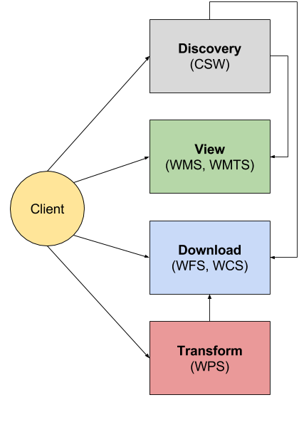
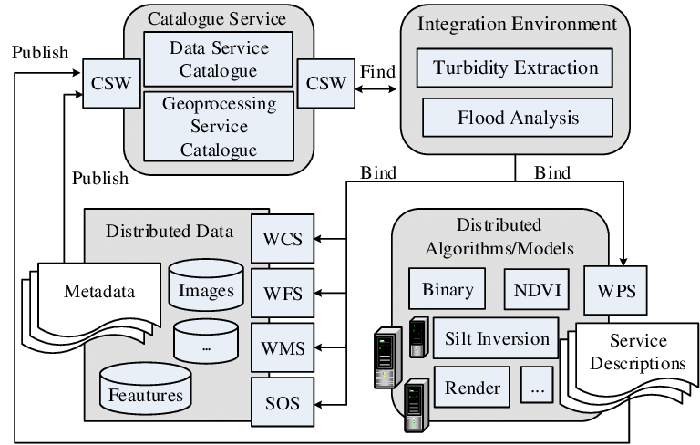

# **Ogc Service Standards**

Análise dos padrões para serviços geoespaciais estabelecidos pelo Open Geospatial Consortium. Este repositório apresenta os resultados da atividade dois do meu cronograma do mestrado.

[Catalog Service for Web (CSW)](./csw)

[Web Coverage Service (WCS)](./wcs)

[Web Feature Service (WFS)](./wfs)

[Web Map Service (WMS)](./wms)

[Web Map Tile Service (WMTS)](./wmts)

[Web Processing Service (WPS)](./wps)

