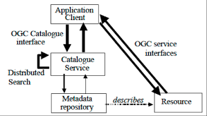

# Catalog Service for Web (CSW)

> provê as informações contidas nos metadados, permitindo a pesquisa, consumo, download, etc., de dados;



## Resources

1. `GetCapabilities`: permite que clientes CSW recuperem metadados de serviço de um servidor

2. `DescribeRecord`: permite que um cliente descubra elementos do modelo de informação suportado pelo serviço de catálogo de destino. A operação permite que parte ou todo o modelo de informação seja descrito .

3. `GetRecords`: procure registros, retornando IDs de registros

4. `GetRecordById`: recupera a representação padrão dos registros de catálogo usando seu identificador

5. `GetDomain` (opcional): usado para obter informações de tempo de execução sobre o intervalo de valores de um elemento de registro de metadados ou parâmetro de solicitação

6. `Harvest` (opcional): crie / atualize metadados pedindo ao servidor para 'extrair' metadados de algum lugar

7. `Transaction` (opcional): crie / edite metadados 'enviando' os metadados para o servidor

## Exemplo

-   Request: `geoserver/csw?service=CSW&version=2.0.2&request=DescribeRecord&typeName=gmd:MD_Metadata`
-   Response:
    ```xml
    <?xml version="1.0" encoding="UTF-8"?>
    <csw:DescribeRecordResponse xmlns:csw="http://www.opengis.net/cat/csw/2.0.2" xmlns:xsi="http://www.w3.org/2001/XMLSchema-instance" xsi:schemaLocation="http://www.opengis.net/cat/csw/2.0.2 http://localhost:8080/geoserver/schemas/csw/2.0.2CSW-discovery.xsd[permanent dead link]">
    <csw:SchemaComponent targetNamespace="http://www.opengis.net/cat/csw/2.0.2" schemaLanguage="http://www.w3.org/XML/Schema">
    <xs:schema xmlns:xs="http://www.w3.org/2001/XMLSchema" xmlns:xlink="http://www.w3.org/1999/xlink" xmlns:gco="http://www.isotc211.org/2005/gco" xmlns:gmd="http://www.isotc211.org/2005/gmd" targetNamespace="http://www.isotc211.org/2005/gmd" elementFormDefault="qualified" version="2012-07-13">
    <!-- ================================= Annotation ================================ -->
    <xs:annotation>
    <xs:documentation>
        Geographic MetaData (GMD) extensible markup language is a component of the XML Schema Implementation of Geographic Information Metadata documented in ISO/TS 19139:2007. GMD includes all the definitions of http://www.isotc211.org/2005/gmd namespace. The root document of this namespace is the file gmd.xsd. This identification.xsd schema implements the UML conceptual schema defined in A.2.2 of ISO 19115:2003. It contains the implementation of the following classes: MD_Identification, MD_BrowseGraphic, MD_DataIdentification, MD_ServiceIdentification, MD_RepresentativeFraction, MD_Usage, MD_Keywords, DS_Association, MD_AggregateInformation, MD_CharacterSetCode, MD_SpatialRepresentationTypeCode, MD_TopicCategoryCode, MD_ProgressCode, MD_KeywordTypeCode, DS_AssociationTypeCode, DS_InitiativeTypeCode, MD_ResolutionType.
    </xs:documentation>
    </xs:annotation>
    ```

[Documentação](https://www.opengeospatial.org/standards/cat)
