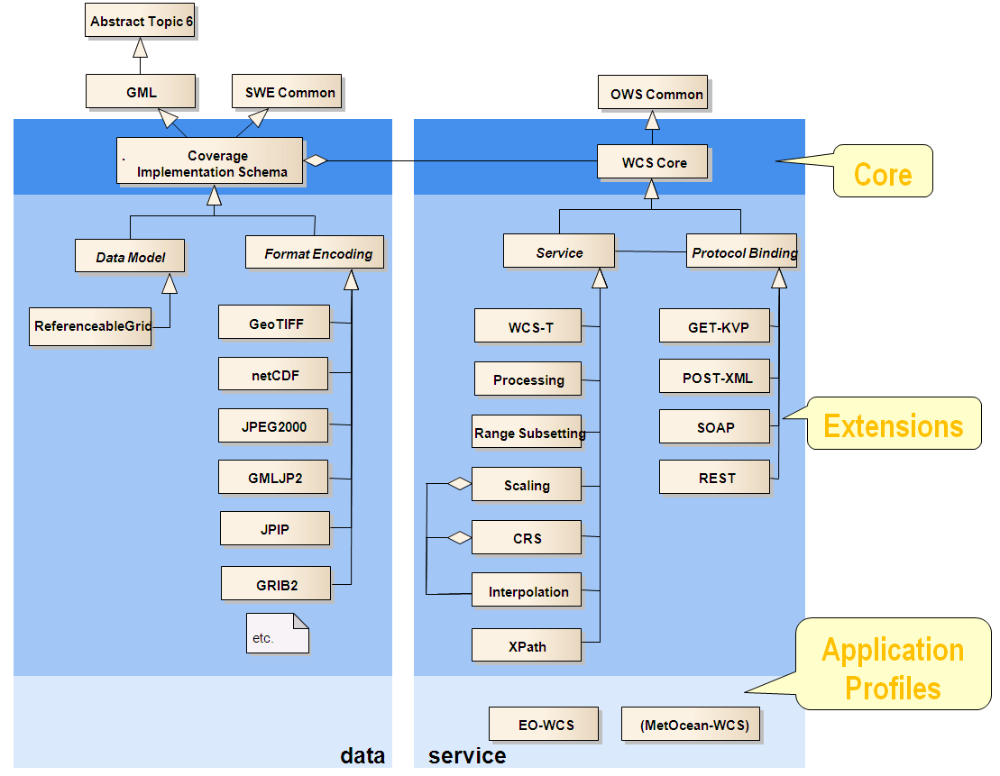

# Web Coverage Service (WCS)

> é representado pelo formato raster e representam fenômenos com variação no tempo/espaço, como dados climáticos, por exemplo;

## Resources

1. `GetCapabilities`: fornece uma descrição codificada em XML das propriedades do serviço e dos dados oferecidos pelo servidor consultado;

2. `DescribeCoverage`: fornece descrições de coberturas codificadas em XML (como sua localização no espaço e no tempo);

3. `GetCoverage`: fornece uma cobertura (ou parte dela), como dados originais ou processados, em algum formato de dados adequado.

## Software

-   MapServer
-   GeoServer
-   ESRI ArcGIS 10.3
-   Pyxis
-   OpenLayers - client

[Documentação](https://www.opengeospatial.org/standards/wcs)
