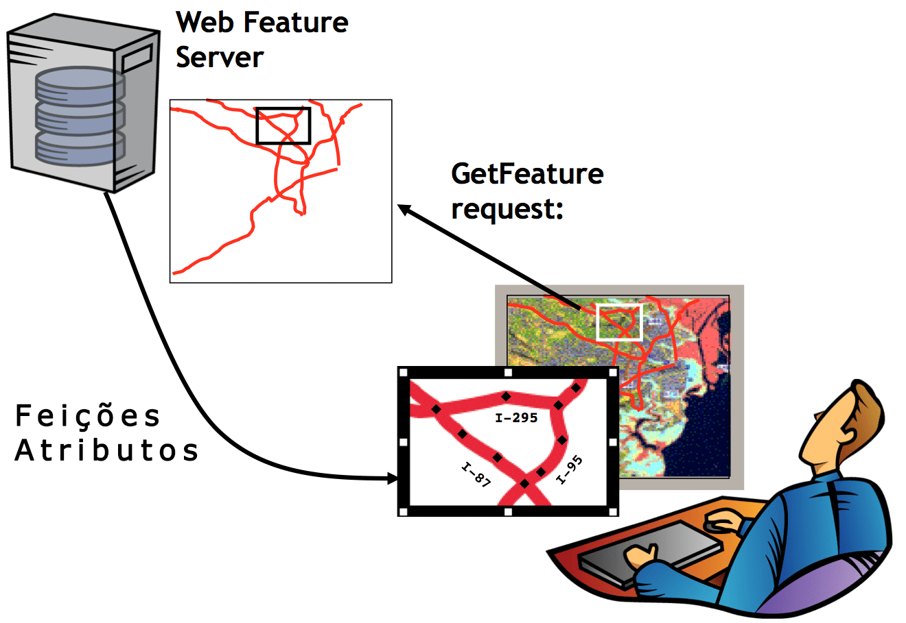

# Web Feature Service (WFS)

> retorna as feições geográficas no formato vetorial;

## Resources

1. `GetCapabilities`: Um serviço de recursos da web deve ser capaz de descrever seus recursos. Especificamente, ele deve indicar quais tipos de recursos ele pode atender e quais operações são suportadas em cada tipo de recurso.

2. `DescribeFeatureType`: Um serviço de recursos da web deve poder, mediante solicitação, descrever a estrutura de qualquer tipo de recurso que possa atender.

3. `GetFeature`: Um serviço de recurso da web deve poder atender a uma solicitação para recuperar instâncias de recurso. Além disso, o cliente deve poder especificar quais propriedades do recurso buscar e deve restringir a consulta espacial e não espacialmente.

4. `GetGmlObject`: Um serviço de recurso da web pode atender a uma solicitação para recuperar instâncias de elementos percorrendo XLinks que se referem a seus IDs XML. Além disso, o cliente deve poder especificar se XLinks aninhados incorporados nos dados do elemento retornado também devem ser recuperados.

5. `Transaction`: Um serviço de recursos da web pode atender a solicitações de transações. Uma solicitação de transação é composta de operações que modificam recursos; isto é, criar, atualizar e excluir operações em recursos geográficos.

6. `LockFeature`: Um serviço de recurso da web pode processar uma solicitação de bloqueio em uma ou mais instâncias de um tipo de recurso pela duração de uma transação. Isso garante que as transações serializáveis sejam suportadas.

[Documentação](https://www.opengeospatial.org/standards/wfs)
