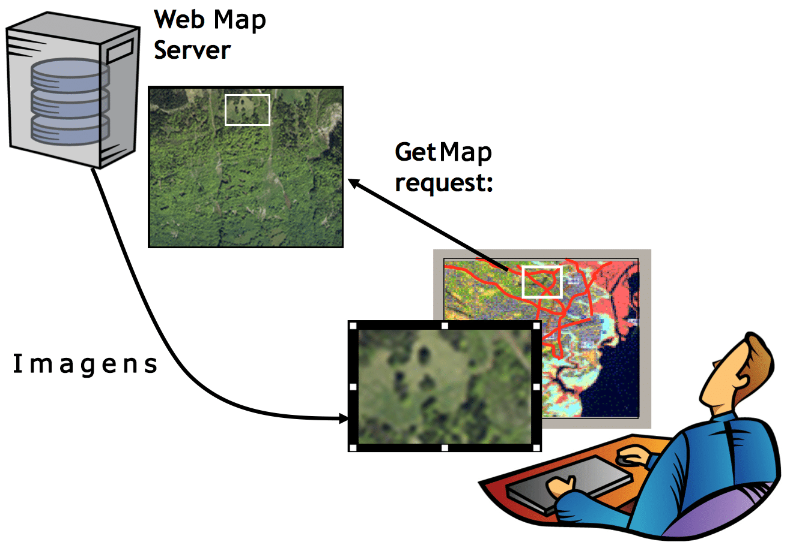

# Web Map Service (WMS)

> retorna as feições geográficas no formato raster (imagem);

Uma busca em um servidor WMS deve ser feita no verbo **HTTP GET** com os seguintes caracteres reservados:

-   ? Separator indicating start of query string.
-   & Separator between parameters in query string.
-   = Separator between name and value of parameter.
-   , Separator between individual values in list-oriented parameters (such as BBOX, LAYERS and STYLES in the GetMap request).
-   \+ Shorthand representation for a space character.

Também é possível realizar a consulta via **HTTP POST** enviando os parâmetros no body or ganizados em XML.

---

## Resources

### Um servidor compatível com WMS DEVE ser capaz de lidar com pelo menos os seguintes 2 tipos de solicitações WMS:

1. `GetCapabilities`: retorna um documento XML com metadados das informações do Web Map Server

2. `GetMap`: retorna uma imagem de um mapa de acordo com as necessidades do usuário.

### E o suporte para os seguintes tipos é opcional:

1. `GetFeatureInfo`: retorna informações sobre os recursos em um local de consulta.

2. `DescribeLayer`: retorna uma descrição XML de uma ou mais camadas do mapa.

3. `GetLegendGraphic`: retorna uma imagem de legenda (ícone) para a camada solicitada, com etiqueta(s).

## Tipos de response

Um WMS pode retornar vários formatos de bitmap como PNG, JPEG, GIF e etc. Também pode retornar formatos vetoriais como SVG.

## Softwares

### Providers (Server-side)

-   deegree
-   GeoServer
-   MapServer
-   MapGuide Open Source
-   QGIS Server

### Consumers (Client-side)

-   Marble

-   D3.js
-   OpenLayers
-   Leaflet.js

[Documentação](https://www.opengeospatial.org/standards/wms)
