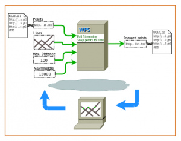

# Web Processing Service (WPS)

> pode-se ser resumido com uma sequência de regras que devem ser seguidas a partir da requisição do usuário final. Tais requisições podem variar de análises raster, como uma detecção de mudança temporal ou mesmo o cruzamento espacial de vetores;

## Resources

1. `GetCapabilities`: retorna metadados no nível de serviço

2. `DescribeProcess`: retorna uma descrição de um processo, incluindo suas entradas e saídas

3. `Execute`: retorna a (s) saída (s) de um processo

## Propriedades

1. As entradas podem ser URLs acessíveis pela Web ou incorporadas à solicitação.

2. As saídas podem ser armazenadas como URLs acessíveis pela Web ou incorporadas na resposta.

3. Para uma única saída, como uma imagem GIF, o WPS pode retornar a saída diretamente, sem nenhum wrapper XML.

4. Ele suporta vários formatos de entrada e saída.

5. Ele suporta processos de execução longa.

6. Suporta SOAP e WSDL.

[Documentação](https://www.opengeospatial.org/standards/wps)
